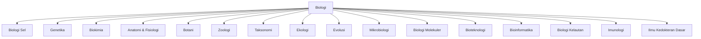

---
tags:
  - biologi
  - sains
  - PKB
created: 2026-08-20
aliases: [biology, biologi-dasar]
---

# Biologi

Biologi (dari bahasa Yunani *bios* = kehidupan + *logos* = ilmu) adalah ilmu yang mempelajari kehidupan dan makhluk hidup, mulai dari level molekul hingga ekosistem global.

## Peta Konsep Biologi



## Cabang-Cabang Biologi

### Fundamental (Mikroskopis)
- [[Biologi Sel]] — Struktur, organel, dan fungsi sel sebagai unit kehidupan
- [[Biokimia]] — Biomolekul (protein, karbohidrat, lipid, asam nukleat), enzim, metabolisme
- [[Genetika]] — Pewarisan sifat, DNA, RNA, mutasi, rekayasa genetika
- [[Biologi Molekuler]] — Mekanisme ekspresi gen: replikasi, transkripsi, translasi

### Organisme & Klasifikasi
- [[Botani]] — Tumbuhan: anatomi, fisiologi, fotosintesis, reproduksi
- [[Zoologi]] — Hewan: klasifikasi, anatomi, perilaku, adaptasi
- [[Taksonomi & Klasifikasi]] — Sistem klasifikasi kehidupan, filogeni, nomenklatur
- [[Mikrobiologi]] — Bakteri, virus, jamur, protista, arkea

### Sistem & Organ
- [[Anatomi & Fisiologi Manusia]] — 11 sistem organ tubuh manusia
- [[Imunologi]] — Sistem kekebalan tubuh, vaksin, alergi, autoimun
- [[Ilmu Kedokteran Dasar]] — Patologi, farmakologi, sel sakit

### Ekologi & Makro
- [[Ekologi]] — Interaksi organisme dengan lingkungan, ekosistem, rantai makanan
- [[Evolusi]] — Perubahan spesies dari waktu ke waktu, seleksi alam, bukti-bukti
- [[Biologi Kelautan & Perairan]] — Ekosistem laut, biota akuatik, konservasi

### Terapan & Modern
- [[Bioteknologi]] — Rekayasa genetika, kloning, GMO, CRISPR
- [[Bioinformatika]] — Analisis data biologi, sekuenomik, computational biology

## Prinsip Dasar Kehidupan

Setiap makhluk hidup memiliki karakteristik berikut:

1. **Organisasi** — Terdiri dari satu atau lebih sel (Teori Sel)
2. **Metabolisme** — Melakukan reaksi kimia untuk mempertahankan hidup
3. **Homeostasis** — Menjaga kondisi internal yang stabil
4. **Pertumbuhan & Perkembangan** — Bertumbuh secara terstruktur
5. **Reproduksi** — Menghasilkan keturunan (seksual atau aseksual)
6. **Respon terhadap rangsangan** — Beradaptasi terhadap perubahan lingkungan
7. **Evolusi** — Berubah secara genetik dari generasi ke generasi

## Tingkat Organisasi Kehidupan

```
Atom → Molekul → Organel → Sel → Jaringan → Organ → Sistem Organ → Organisme → Populasi → Komunitas → Ekosistem → Bioma → Biosfer
```

| Tingkat | Penjelasan | Contoh |
| --- | --- | --- |
| Atom | Unit terkecil materi | C, H, O, N, P, S |
| Molekul | Gabungan atom | Air (H₂O), glukosa (C₆H₁₂O₆) |
| Organel | Struktur dalam sel | Mitokondria, ribosom |
| Sel | Unit terkecil kehidupan | Sel otot, sel saraf |
| Jaringan | Kumpulan sel sejenis | Jaringan epitel, jaringan meristem |
| Organ | Kumpulan jaringan | Jantung, paru-paru, daun |
| Sistem organ | Organ yang bekerja sama | Sistem pencernaan, sistem saraf |
| Organisme | Makhluk hidup utuh | Manusia, pohon jati, bakteri |
| Populasi | Kelompok spesies di satu tempat | Populasi harimau di Taman Nasional |
| Komunitas | Kumpulan populasi berbeda | Hutan hujan tropis |
| Ekosistem | Komunitas + faktor abiotik | Terumbu karang, savana |
| Bioma | Ekosistem dengan iklim serupa | Hutan hujan, gurun, tundra |
| Biosfer | Seluruh kehidupan di Bumi | Lapisan kehidupan di Bumi |

## Dua Domain Kehidupan Utama

### Prokariota
- Tidak memiliki membran inti (nukleus)
- DNA berupa **nucleoid** (circular)
- Tidak memiliki organel bermembran
- Contoh: [[Mikrobiologi|Bakteri]], Arkea

### Eukariota
- Memiliki membran inti (nukleus) yang jelas
- DNA berbentuk kromosom linear
- Memiliki organel bermembran (mitokondria, retikulum endoplasma, dll.)
- Contoh: Tumbuhan, hewan, jamur, protista

## Topik Terkait
- [[Biologi Sel]]
- [[Biokimia]]
- [[Genetika]]
- [[Ekologi]]
- [[Evolusi]]
- [[Taksonomi & Klasifikasi]]
